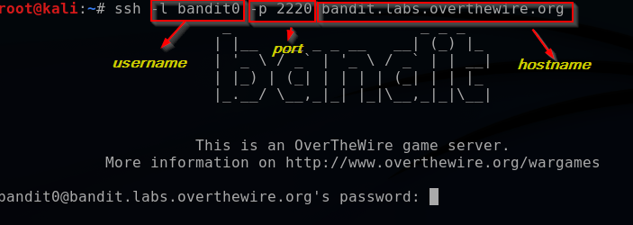
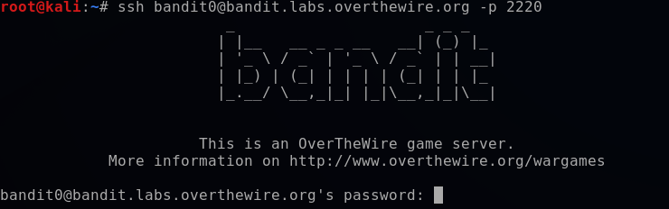

# Getting start with bandit!

## Level Goal

The goal of this level is for you to log into the game using SSH. The host to which you need to connect is bandit.labs.overthewire.org, on port 2220. The username is bandit0 and the password is bandit0. Once logged in, go to the Level 1 page to find out how to beat Level 1.

## How to solve



we use ssh command to remote login with username is bandit0 and password also bandit0

```console
ssh -l bandit0 -p 2220 bandit.labs.overthewire.org
```


```console
ssh bandit0@bandit.labs.overthewire.org -p 2220
```

## Flag

NH2SXQwcBdpmTEzi3bvBHMM9H66vVXjL
