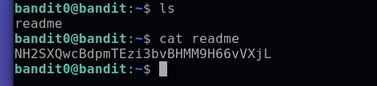

# Bandit00-01

## Level Goal

The password for the next level is stored in a file called readme located in the home directory. Use this password to log into bandit1 using SSH. Whenever you find a password for a level, use SSH (on port 2220) to log into that level and continue the game.

## How to solve



use "ls" command to check file in this directory

```console
ls
```

we can see that it contains file name "readme" 
we want to see inside the file so we use
command "cat"
```console
cat readme
```

## Flag

NH2SXQwcBdpmTEzi3bvBHMM9H66vVXjL
