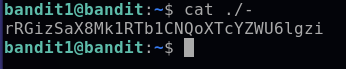

# Bandit01-02

## Level Goal

The password for the next level is stored in a file called - located in the home directory

## How to solve

we can see that file name contains special character , we cannot use command and follow by the file name.



use "./" before the file name so the command know that this is file name

```console
cat ./-
```

## Flag

rRGizSaX8Mk1RTb1CNQoXTcYZWU6lgzi
