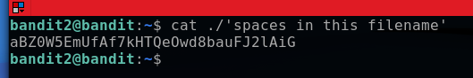

# Bandit02-03

## Level Goal

The password for the next level is stored in a file called spaces in this filename located in the home directory

## How to solve

We unable to open this file because it contains space in the name so we use " '' "  to let the command know this is the name of file
start from ' and end with this'



```console
cat ./'spaces in the filename'
```

## Flag

aBZ0W5EmUfAf7kHTQeOwd8bauFJ2lAiG
